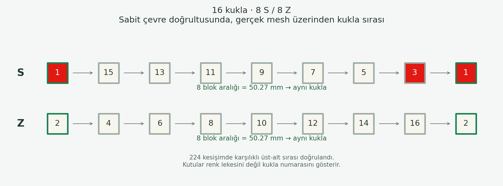

> Guncel durum: son canli gorunum kullanici tarafindan reddedildi; uretim 73cacd4 durumuna geri alindi. Bu rapor arsivlenen adaya aittir. Calisma ve denetim araci BraidStudio-photo-study kopyasinda korunur.

# 16 kukla / 8 S + 8 Z tekrar kontrolu

Sonuc: incelenen 16 kuklali Diamond mesh'inde ayni yonde 8 farkli kukladan
sonra ayni kuklaya donuluyor. Geometriyi yeniden yazmayi gerektiren bir
8-blok tekrar hatasi bu kontrolde bulunmadi.

## Onceki gorsel neden uygun bir karsilastirma degildi?

Son malzeme gorseli 32 kukla / 16S + 16Z idi. 30 kesisim aralikli ornegin
uzunlugu 47.12 mm; bir tam turu 50.27 mm. Yalniz 0.9375 tur gorunuyordu.
Dolayisiyla 16 kukla / 8S + 8Z tekrari bu resimden degerlendirilemez.

## Gercek mesh'ten kontrol

Ornek: 16 kukla, 16 mm, 45 derece, kukla basina 12 ip x 1000D, 1 ust / 1 alt.
`carrier-repeat-audit.py` baska bir geometri uretmez: mevcut `build_geometry()`
ciktisinin sweep mesh tacindaki vertex'leri kutupsal koordinatlarda okur.
Sabit cevre dogrultusundan gecen kukla kimliklerini eksen boyunca siralar.

- S: 1, 15, 13, 11, 9, 7, 5, 3, **1**.
- Z: 2, 4, 6, 8, 10, 12, 14, 16, **2**.
- Arada 8 blok araligi; eksenel donus 50.26548 mm.
- 224 kesisimde karsi ailenin gercek mesh konumu bulunup ust-alt emri ve
  iki mesh tacinin radyal sirasi kontrol edildi. En kucuk tac ayrimi 0.38108 mm.
  Bu deger tum yuzeyler icin carpismasizlik/penetrasyonsuzluk kaniti degildir.
- Kalici regresyon testi ayni 8-blok tekrarini hem normal hem ters kukla
  dagiliminda dogrudan mesh koordinatlarindan kontrol eder.

## Iki farkli tekrar

Modelde C cevre, alpha eksene gore orgu acisi, M=N/2 olsun.
Bir tam helis turunun eksenel uzunlugu P=C/tan(alpha).
Kesisim araligi delta=P/N. Ayni yonde komsu blok araligi 2*delta=P/M.
Ayni kukla M adet ayni-yon blok araligi sonra geri gelir.

16 kuklali Diamond icin: 8 ayni-yon blok araligi = 16 ust/alt kesisim
araligi = bir tam tur. Ust-alt sirasi ise 2 kesisimde tekrarlar; bu ayni
kuklanin veya renk deseninin geri dondugu anlamina gelmez. Birden fazla
kuklada ayni renk varsa renk lekesi, kukla kimliginden daha kisa tekrar
izlenimi verebilir. Bu nedenle kontrolde numaralar kullanildi.

Arayuzde eski "Desen tekrari" etiketi "Ust-alt tekrari" olarak duzeltildi;
"Ayni kuklanin donusu" ayri gosterilir. Ekran cekimindeki kukla/S-Z etiketi,
yanlis receteyle karsilastirma yapilmasini onler.

## Kanitlar ve sinir

[16 kukla halat](proofs/carrier-repeat-16/normal.png) ·
[Yakin](proofs/carrier-repeat-16/close.png) ·
[Mobil](proofs/carrier-repeat-16/mobile.png) ·
[Ham kimlik olcumu](proofs/carrier-repeat-16/audit.json)

12 test gecti. Sozdizimi/diff kontrolleri gecti. Chromium raporunda hata yok.
Malzeme dosyasi `a536b43` geri donus commit'iyle aynidir. Geometri yollarina
mudahale edilmedi; tekrar aciklama alanlari eklendi. Canli dagitim yapilmadi.
Bu kontrol 16 kuklali 1/1 ornegi icindir; tum makine tipleri ve tum fiziksel
sikisma kosullari dogrulanmis sayilmaz.

Genel maypole duzeninde iki grubun karsi yonlerde donmesine iliskin kaynak:
[Geometrical modelling and control of a triaxial braiding machine (2003)](https://www.sciencedirect.com/science/article/pii/S1359835X03000617).
Yukaridaki sayisal sonuc bu kaynaktan alinmadi; yerel mesh'ten olculdu.
