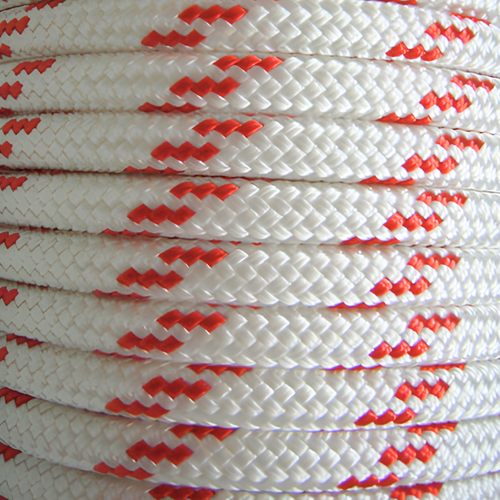
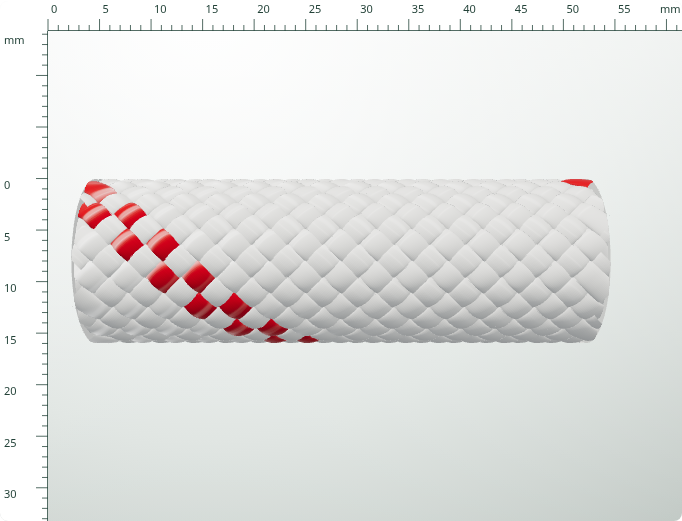

> Guncel durum: son canli gorunum kullanici tarafindan reddedildi; uretim 73cacd4 durumuna geri alindi. Bu rapor arsivlenen adaya aittir. Calisma ve denetim araci BraidStudio-photo-study kopyasinda korunur.

# Fotograf referansina gore polyester adayi

Durum: gorsel aday, kullanici kabulu ve canli dagitim yok.
Geri donus noktasi: `73cacd4`. Izole dal: `work/photo-reference`.

## Goruntuler

| Kullanici referansi | Yeni halat adayi |
| --- | --- |
|  |  |

[Yakindan incele](proofs/photo-reference-rope/close.png) ·
[Telefon](proofs/photo-reference-rope/mobile.png) ·
[Ayni receteden kesisim](proofs/photo-reference-crossing/normal.png) ·
[Varsayilan ayarlar](proofs/photo-reference-default/normal.png)

Referanstaki fotograf birden fazla sarim, farkli kamera ve aydinlatma icerir.
Bu nedenle goruntuler piksel bazinda eslesme veya olculmus malzeme kalibrasyonu
olarak sunulmuyor. 32 kukla / 16 mm / 45 derece / kukla basina 12 ip x 1000D
bir deneme recetesidir; fotograf uzerinden kesin recete cikarilmadi.
Varsayilan 16 kukla / 10 mm goruntusu ayrica kontrol edilir.

## Degisiklik

- Calismayan RectAreaLight kurulumu yerine tek renderer icinde PMREM ile
  studyo yansimasi. Harici kaynak veya uretilmis fotograf yok.
- Polyester paketlerinin birbirine golge dusurmesi acildi ve golge kamerasi
  geometri olcegine gore ayarlandi.
- Renk haritasina boyanmis satin parlamasi kaldirildi. Ince boyuna filament
  normalleri, anisotropik yansima ve ortam isigi kullanildi.
- Denye profili 0.70'ten 1.0'a duzeltildi: beyan edilen polimer miktari korunur.
- Polip profilinin ortam ve carrier-golge davranisi degistirilmedi.
- Python geometri cekirdegi, kukla renk kimlikleri, S/Z yollari ve orgu sirasi
  degistirilmedi. Yeni geometri motoru veya ikinci fiber kabuk eklenmedi.

## Dogrulamanin siniri

Fotografin ayni gercekligine ulasildigi iddia edilmiyor. Beyaz paketin
makro bicimi halen idealize; gercek filament sayisi, kesit bicimi,
bukum/teksture, parlaklik sinifi, ip gerilimi ve oz olculeri kalibre edilmedi.
Filament normal dokusu gorunen yuzey yogunlugu yaklasimidir; F sayisi degildir.
Gorsel kabul otomatik test basarisindan ayri tutulur.

Teknik kaynaklar: [Three.js RectAreaLight](https://threejs.org/docs/pages/RectAreaLight.html)
(LTC kurulumu gerektirir) ve
[MeshPhysicalMaterial](https://threejs.org/docs/pages/MeshPhysicalMaterial.html)
(ortam yansimasi ve anisotropi).

## Yurutulen kontroller

- `node tests/unifiedGeometry.test.js`: 11 gecti, 0 basarisiz.
- `npm run check` ve `git diff --check`: basarili.
- Uc son ekran cekiminde browserErrors bos; 32/2/16 carrier golgesi aktif.
- Halat, kesisim ve varsayilan cekiminde 1000D girdi = 1000D etkin denye.
- Kanitlar ve kaynak SHA256 kayitlari: `proofs/photo-reference/validation.json`.
- Alternatif kesit denemesi reddedilip geri alindi; teslim geometri cekirdegi
  geri donus commit'iyle birebir aynidir.

## Kullanicinin kirmizi yansima geri bildirimi

Beyaz kabul edilebilir bulundu; beyazin optikleri ve tum sahne isiklari
korundu. Kirmizidaki kaplama benzeri beyaz bant, daha dusuk yansima gucu,
daha yuksek mikro puruzluluk ve filament specular haritasiyla azaltildi.
Bu renkli ip ayari ampirik gorunum eslestirmesidir; olculmus BRDF iddiasi yoktur.

[Yeni halat](proofs/red-reflection-rope/normal.png) ·
[Yakindan](proofs/red-reflection-rope/close.png) ·
[Kirmizi kesisim](proofs/red-reflection-crossing/close.png)

11 test, sozdizimi ve diff kontrolleri gecti. Son kaynak/ekran dogrulamasi:
`proofs/red-reflection-rope/validation.json`.
Onceki `photo-reference/validation.json`, onceki adayin kaynak karmalarini tutar.

Son ince ayar: kirmizi specular 0.72 -> 0.60, ortam yansimasi 1.60 -> 1.35.
Beyaz ve sahne isiklari korunur.
[Yumusatilmis kirmizi](proofs/red-reflection-soft-crossing/close.png) ·
[Halat](proofs/red-reflection-soft-rope/normal.png).
